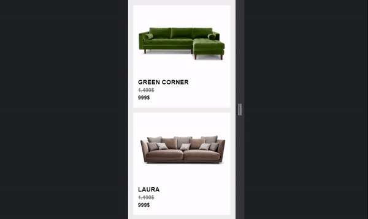

<!-- PROJECT LOGO -->
 

  

  <h3 align="center">Furniture</h3>

  

    An awesome furniture website front-end template
     
  

  
Table of Contents

  <ul>
    <li>
      <a href="#Project-features">Project features</a>
      <ul>
        <li>
            <a href="#its-bem-based">It's BEM based</a>
        </li>
        <li>
            <a href="#it-uses-variables">It uses variables</a>
        </li>
        <li>
            <a href="#mixins">mixins</a>
        </li>
        <li>
            <a href="#animations">Animations</a>
        </li>
        <li>
            <a href="#some-wonderful-features">Some wonderful features</a>
        </li>
        <li>
            <a href="#responsive">Responsive</a>
        </li>
        <li>
            <a href="#built-with">Built with</a>
        </li>
        <li>
            <a href="#contact">Contact</a>
        </li>
      </ul>
    </li>
    <li>
      <a href="#getting-started">Getting Started</a>
    </li>
    <li><a href="#usage">Usage</a></li>
    <li><a href="#roadmap">Roadmap</a></li>
    <li><a href="#contributing">Contributing</a></li>
    <li><a href="#license">License</a></li>
    <li><a href="#contact">Contact</a></li>
    <li><a href="#acknowledgments">Acknowledgments</a></li>
  </ul>

<!-- ABOUT THE PROJECT -->
## Project features

There are many great features in this project.
note it has styled using sass

### It's BEM based
Every HTML element has a BEM based class name: 
BEM help developers to select elements in css, much more better and organized.
 

 

### It uses variables
All variables stored in _variables.scss file and it is filled by useful variables for all over the project such as "colors", "margins" and etc. so you can easily change some variable values to change it in the whole project
 

 

### mixins
The mixins are awesome, mixins help developer to add similar styles to many elements by less codes, and some mixins in this project could get wanted values to style more customized.
 

 

### Animations
Houwever the most animations in this project executed by AOS library but some animations coded and styled manually in "_animations.scss" file.
 

 

### Some wonderful features
Here is some features of project that you can see on executed project on main page (index.html), isn't it amazing? :smile:

#### Accordion
Accordion section of main page, the wonderful part of this section is its hover effect
 

 

### Responsive
It developed responsive to execute well on any device such as mini size mobile phones and big size wide monitors. however the bes experience of usage is for desktop size monitors because of some ":hover" effects (when mouse is on an element).
 

 

### Built With

This project made using following technologies:

* [![html5][html5]][html5-url]
* [![Sass][Sass]][Sass-url]
* [![css3][css3]][css3-url]
* [![git][git]][git-url]
* [![github][github]][github-url]

<!-- CONTACT -->
## Contact

Khashayar Asghari - [@your_twitter](https://twitter.com/khashayar_asgh) - eng.asghari75.com

Project Link: [https://github.com/KhashayarAsghari/Furniture](https://github.com/KhashayarAsghari/Furniture)

<!-- MARKDOWN LINKS & IMAGES -->
[html5]: https://img.shields.io/badge/html5-E34F26?style=for-the-badge&logo=html5&logoColor=white
[html5-url]: https://www.w3.org/
[Sass]: https://img.shields.io/badge/Sass-CC6699?style=for-the-badge&logo=sass&logoColor=white
[Sass-url]: https://sass-lang.com/
[css3]: https://img.shields.io/badge/css3-35495E?style=for-the-badge&logo=css3&logoColor=white
[css3-url]: https://w3.com/
[git]: https://img.shields.io/badge/git-F05032?style=for-the-badge&logo=git&logoColor=white
[git-url]: https://git-scm.com/
[github]: https://img.shields.io/badge/github-181717?style=for-the-badge&logo=github&logoColor=white
[github-url]: https://github.com/